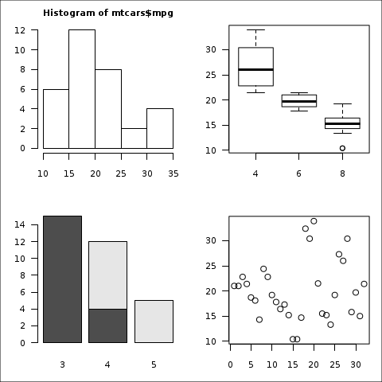
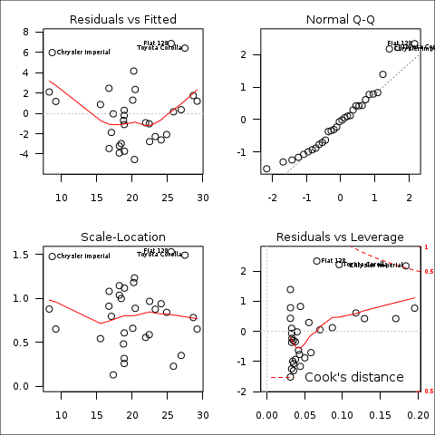

knitr skeleton

<font color = red>
NOTES

</font>


```r
## project directory
projdir <- '~/Documents/r.packages/knitr/'


## files: 
## 00-master.Rmd
## 00-surv.Rmd
```


```r
## knit in console:
knitr::knit(paste0(projdir, 'knitr_skeleton.Rmd'), encoding = 'UTF-8')
## convert to html
knitr::knit2html(paste0(projdir, 'knitr_skeleton.Rmd'))
## open in default browser
browseURL(paste0(projdir, 'knitr_skeleton.html'))
```


<font align = center>

#### knitr skeleton

Description: a knitr template to use for documents.

Most recent compile: 13 July 2014

Department of Something   
Some Place

Statisticians:    
First Last, <a href="mailto:handle@site.edu?subject=subject">email address</a>

</font>

<font size = 1>
All analyses were performed using R version 3.1.1 (2014-07-10) and packages `Gmisc` v for table output ; `rawr` v ([source](https://github.com/raredd/rawr)), a personal package with helper tools; and `knitr` v1.6 [Xie, 2013] for reproducible research.
</font>

#### Table of contents   
\* [Outline](#outline)   
\* [Introduction](#intro)    
\* [Statistical methods](#stats)     
\* [Results](#results)  
\* [Discussion](#discuss)   
\* [References](#ref)   

----

#### <a id = "outline">Outline</a>

1. Abstract
2. Intro
3. Stats
4. Results
    + Table 1
    + Table 2
    + Figure 1
    + Figure 2
5. Discussion 
6. References

#### Abstract
*PURPOSE:* This study has some purpose.
*PATIENTS & METHODS:* We obtained some patients from somewhere, and some statistical things were done.
*RESULTS:* There were some results that may be interesting.
*CONCLUSION:* Conclude: it is as we said.

#### <a id = 'intro'>Introduction</a>
Description of the study. **Primary** objectives and **secondary** objectives.

#### <a id = 'stats'>Statistical methods</a>
We did some specific statistical methods.

Analyses were performed using R version 3.1.1 (2014-07-10).

#### <a id = 'results'>Results</a>
Results go here.

[Table 1](#t1) shows the patient characteristics.

<a id='t1'></a>

```r
describeMedian_minmax <- function(...) describeMedian(..., iqr = FALSE)

## t1 wrapper function 1
getT1stat <- function(varname, digits = 0) {
  getDescriptionStatsBy(data[ , varname],
                        data$treat,
                        add_total_col = TRUE, 
                        show_all_values = TRUE,
                        hrzl_prop = FALSE,
                        statistics = FALSE,
                        html = TRUE,
                        digits = digits,
                        continuous_fn = describeMedian_minmax)
}

## some sample data
set.seed(1618)
f <- function(...) sample(..., 100, replace = TRUE)
data <- data.frame(age = rpois(100, 50),
                   cat_var = f(LETTERS[1:5]),
                   sex = f(c('Male','Female')),
                   race = f(c('Black','White','Asian')),
                   treat = factor(f(1:3), labels = c('Treatment A', 
                                                     'Treatment B', 
                                                     'Placebo')))
data <- within(data, {
  age_cat <- cut(age, c(-Inf, 40, 50, 60, Inf), labels = c('&le; 40','41 - 50',
                                                           '51 - 60','60 +'))
})

## table 1 stats
table_data <- list()
table_data[['Age']] <- rbind(getT1stat('age', digits = 1),
                             getT1stat('age_cat', digits = 1))
table_data[['Some categorical<br>&nbsp;&nbsp;variable']] <- getT1stat('cat_var')
table_data[['Sex']] <- getT1stat('sex')
table_data[['Race']] <- getT1stat('race')

## merge everything into a matrix 
## (matrices are preferred since they allow for duplicated rownames)
## create the rgroup & n.rgroup variables automatically
output_data <- do.call(rbind, table_data)
rgroup <- names(table_data)
n.rgroup <- unname(sapply(rgroup, function(x) nrow(table_data[[x]])))

# add a column spanner for the status columns
cgroup <- c("", "Type of treatment<sup>&dagger;</sup>")
n.cgroup <- c(1, 3) 
colnames(output_data) <- 
  c(paste0('Total<br><font weight = normal; size = 1>n = ',
           nrow(data), '</font>'),
    paste0('Treated A<br><font weight = normal; size = 1>n = ',
           sum(data$treat == 'Treatment A'),'</font>'),
    paste0('Treatment B<sup>&Dagger;</sup><br><font weight = normal; size = 1>n = ',
           sum(data$treat == 'Treatment B'),'</font>'),
    paste0('Placebo<br><font weight = normal; size = 1>n = ',
           sum(data$treat == 'Placebo'),'</font>'))


## create table with Gmisc package
inc_num('table')
htmlTable(output_data, align = 'rccc',
          rgroup = rgroup, n.rgroup = n.rgroup, 
          rgroupCSSseparator = '', 
          cgroup = cgroup,
          n.cgroup = n.cgroup,
          rowlabel = '', 
          ctable = TRUE, # latex-style table lines
          caption = "Table 1: Patient demographics", 
          altcol = c('grey97', 'white'),
          tfoot = paste0(
            "<font size=1>Abbreviations: ECOG, Eastern Cooperative Oncology Group;
            PS, performance score<br>
            <sup>&dagger;</sup>Trial groups for a new wonder drug<br>
            <sup>&Dagger;</sup> Twice the dosage of treatment A</font>"))
```

<table class='gmisc_table' style='border-collapse: collapse;' >
	<thead>
	<tr><td colspan='6' style='text-align: left;'>
	Table 1: Patient demographics</td></tr>
	<tr>
		<th style='border-top: 2px solid grey;'></th>
		<th colspan='1' style='font-weight: 900; border-top: 2px solid grey; text-align: center;'>&nbsp;</th><th style='border-top: 2px solid grey;; border-bottom: hidden;'>&nbsp;</th>
		<th colspan='3' style='font-weight: 900; border-bottom: 1px solid grey; border-top: 2px solid grey;'>Type of treatment<sup>&dagger;</sup></th>
	</tr>
	<tr>
		<th style='border-bottom: 1px solid grey; '>&nbsp;</th>
		<th style='border-bottom: 1px solid grey; text-align: center;'>Total<br><font weight = normal; size = 1>n = 100</font></th>
		<th style='border-bottom: 1px solid grey;' colspan='1'>&nbsp;</th>
		<th style='border-bottom: 1px solid grey; text-align: center;'>Treated A<br><font weight = normal; size = 1>n = 31</font></th>
		<th style='border-bottom: 1px solid grey; text-align: center;'>Treatment B<sup>&Dagger;</sup><br><font weight = normal; size = 1>n = 38</font></th>
		<th style='border-bottom: 1px solid grey; text-align: center;'>Placebo<br><font weight = normal; size = 1>n = 31</font></th>
	</tr>
	</thead><tbody>
	<tr style='background-color:#f7f7f7;'><td colspan='6' style='font-weight: 900;'>Age</td></tr>
	<tr style='background-color:#f7f7f7;'>
		<td style='text-align: left;'>&nbsp;&nbsp;Median (range)</td>
		<td style='text-align: right;'>48.5 (35.0 - 75.0)</td>
		<td style='' colspan='1'>&nbsp;</td>
		<td style='text-align: center;'>49.0 (35.0 - 63.0)</td>
		<td style='text-align: center;'>48.0 (38.0 - 75.0)</td>
		<td style='text-align: center;'>49.0 (37.0 - 61.0)</td>
	</tr>
	<tr style='background-color:#f7f7f7;'>
		<td style='text-align: left;'>&nbsp;&nbsp;&le; 40</td>
		<td style='text-align: right;'>8 (8.0%)</td>
		<td style='' colspan='1'>&nbsp;</td>
		<td style='text-align: center;'>3 (9.7%)</td>
		<td style='text-align: center;'>1 (2.6%)</td>
		<td style='text-align: center;'>4 (12.9%)</td>
	</tr>
	<tr style='background-color:#f7f7f7;'>
		<td style='text-align: left;'>&nbsp;&nbsp;41 - 50</td>
		<td style='text-align: right;'>58 (58.0%)</td>
		<td style='' colspan='1'>&nbsp;</td>
		<td style='text-align: center;'>17 (54.8%)</td>
		<td style='text-align: center;'>26 (68.4%)</td>
		<td style='text-align: center;'>15 (48.4%)</td>
	</tr>
	<tr style='background-color:#f7f7f7;'>
		<td style='text-align: left;'>&nbsp;&nbsp;51 - 60</td>
		<td style='text-align: right;'>27 (27.0%)</td>
		<td style='' colspan='1'>&nbsp;</td>
		<td style='text-align: center;'>8 (25.8%)</td>
		<td style='text-align: center;'>8 (21.1%)</td>
		<td style='text-align: center;'>11 (35.5%)</td>
	</tr>
	<tr style='background-color:#f7f7f7;'>
		<td style='text-align: left;'>&nbsp;&nbsp;60 +</td>
		<td style='text-align: right;'>7 (7.0%)</td>
		<td style='' colspan='1'>&nbsp;</td>
		<td style='text-align: center;'>3 (9.7%)</td>
		<td style='text-align: center;'>3 (7.9%)</td>
		<td style='text-align: center;'>1 (3.2%)</td>
	</tr>
	<tr style='background-color:#ffffff;'><td colspan='6' style='font-weight: 900; '>Some categorical<br>&nbsp;&nbsp;variable</td></tr>
	<tr style='background-color:#ffffff;'>
		<td style='text-align: left;'>&nbsp;&nbsp;A</td>
		<td style='text-align: right;'>25 (25%)</td>
		<td style='' colspan='1'>&nbsp;</td>
		<td style='text-align: center;'>9 (29%)</td>
		<td style='text-align: center;'>11 (29%)</td>
		<td style='text-align: center;'>5 (16%)</td>
	</tr>
	<tr style='background-color:#ffffff;'>
		<td style='text-align: left;'>&nbsp;&nbsp;B</td>
		<td style='text-align: right;'>19 (19%)</td>
		<td style='' colspan='1'>&nbsp;</td>
		<td style='text-align: center;'>5 (16%)</td>
		<td style='text-align: center;'>7 (18%)</td>
		<td style='text-align: center;'>7 (23%)</td>
	</tr>
	<tr style='background-color:#ffffff;'>
		<td style='text-align: left;'>&nbsp;&nbsp;C</td>
		<td style='text-align: right;'>24 (24%)</td>
		<td style='' colspan='1'>&nbsp;</td>
		<td style='text-align: center;'>7 (23%)</td>
		<td style='text-align: center;'>8 (21%)</td>
		<td style='text-align: center;'>9 (29%)</td>
	</tr>
	<tr style='background-color:#ffffff;'>
		<td style='text-align: left;'>&nbsp;&nbsp;D</td>
		<td style='text-align: right;'>18 (18%)</td>
		<td style='' colspan='1'>&nbsp;</td>
		<td style='text-align: center;'>8 (26%)</td>
		<td style='text-align: center;'>6 (16%)</td>
		<td style='text-align: center;'>4 (13%)</td>
	</tr>
	<tr style='background-color:#ffffff;'>
		<td style='text-align: left;'>&nbsp;&nbsp;E</td>
		<td style='text-align: right;'>14 (14%)</td>
		<td style='' colspan='1'>&nbsp;</td>
		<td style='text-align: center;'>2 (6%)</td>
		<td style='text-align: center;'>6 (16%)</td>
		<td style='text-align: center;'>6 (19%)</td>
	</tr>
	<tr style='background-color:#f7f7f7;'><td colspan='6' style='font-weight: 900; '>Sex</td></tr>
	<tr style='background-color:#f7f7f7;'>
		<td style='text-align: left;'>&nbsp;&nbsp;Female</td>
		<td style='text-align: right;'>47 (47%)</td>
		<td style='' colspan='1'>&nbsp;</td>
		<td style='text-align: center;'>15 (48%)</td>
		<td style='text-align: center;'>18 (47%)</td>
		<td style='text-align: center;'>14 (45%)</td>
	</tr>
	<tr style='background-color:#f7f7f7;'>
		<td style='text-align: left;'>&nbsp;&nbsp;Male</td>
		<td style='text-align: right;'>53 (53%)</td>
		<td style='' colspan='1'>&nbsp;</td>
		<td style='text-align: center;'>16 (52%)</td>
		<td style='text-align: center;'>20 (53%)</td>
		<td style='text-align: center;'>17 (55%)</td>
	</tr>
	<tr style='background-color:#ffffff;'><td colspan='6' style='font-weight: 900; '>Race</td></tr>
	<tr style='background-color:#ffffff;'>
		<td style='text-align: left;'>&nbsp;&nbsp;Asian</td>
		<td style='text-align: right;'>32 (32%)</td>
		<td style='' colspan='1'>&nbsp;</td>
		<td style='text-align: center;'>9 (29%)</td>
		<td style='text-align: center;'>14 (37%)</td>
		<td style='text-align: center;'>9 (29%)</td>
	</tr>
	<tr style='background-color:#ffffff;'>
		<td style='text-align: left;'>&nbsp;&nbsp;Black</td>
		<td style='text-align: right;'>35 (35%)</td>
		<td style='' colspan='1'>&nbsp;</td>
		<td style='text-align: center;'>10 (32%)</td>
		<td style='text-align: center;'>13 (34%)</td>
		<td style='text-align: center;'>12 (39%)</td>
	</tr>
	<tr style='background-color:#ffffff;'>
		<td style='border-bottom: 2px solid grey; text-align: left;'>&nbsp;&nbsp;White</td>
		<td style='border-bottom: 2px solid grey; text-align: right;'>33 (33%)</td>
		<td style='border-bottom: 2px solid grey;' colspan='1'>&nbsp;</td>
		<td style='border-bottom: 2px solid grey; text-align: center;'>12 (39%)</td>
		<td style='border-bottom: 2px solid grey; text-align: center;'>11 (29%)</td>
		<td style='border-bottom: 2px solid grey; text-align: center;'>10 (32%)</td>
	</tr>
	</tbody>
	<tfoot><tr><td colspan=6>
	<font size=1>Abbreviations: ECOG, Eastern Cooperative Oncology Group;
            PS, performance score<br>
            <sup>&dagger;</sup>Trial groups for a new wonder drug<br>
            <sup>&Dagger;</sup> Twice the dosage of treatment A</font></td></tr></tfoot>
</table>

We can use an in-line chunk and caluclate the median age (48.5) without writing the number in myself! We define the median as

$$\operatorname{P}(X\leq m) \geq \frac{1}{2}\text{ and }\operatorname{P}(X\geq m) \geq \frac{1}{2}$$ for any $m \in \mathbb{R}$.

Here are some figures we generated in [Figure I](#f1).

<a id='f1'></a>

```r
op <- par(no.readonly = TRUE)
par(mar = c(3,3,2,1), oma = c(0,0,0,0),
    mfrow = c(2,2), xpd = FALSE, 
    cex.lab = .8, cex.main = .8, cex.axis = .8, las = 1)
inc_num('figure')
hist(mtcars$mpg)
boxplot(mpg ~ cyl, data = mtcars)
barplot(table(mtcars$am, mtcars$gear))
plot(mtcars$mpg)
```

<figure><figcaption>Figure I: Some example plots</figcaption></figure>

As we saw in Figure 1, something something, and we can also see in [Figure II](#f2), something.

<a id='f2'></a>

```r
par(mar = c(3,3,2,1), oma = c(0,0,0,0),
    mfrow = c(2,2), xpd = FALSE, 
    cex.lab = .8, cex.main = .8, cex.axis = .8, las = 1)
fit <- lm(mpg ~ wt, data = mtcars)
inc_num('figure')
plot(fit, cex.id = .5, cex.caption = .8)
```

<figure><figcaption>Figure II: Some example plots</figcaption></figure>

And we will also check the table counter in [Table 2](#t2).

<a id='t2'></a>

```r
inc_num('table')
htmlTable(mtcars[1:10, ], caption = 'Table 2: Some table.')
```

<table class='gmisc_table' style='border-collapse: collapse;' >
	<thead>
	<tr><td colspan='12' style='text-align: left;'>
	Table 2: Some table.</td></tr>
	<tr>
		<th style='font-weight: 900; border-bottom: 1px solid grey; border-top: 4px double grey;'>mtcars</th>
		<th style='border-bottom: 1px solid grey; border-top: 4px double grey; text-align: center;'>mpg</th>
		<th style='border-bottom: 1px solid grey; border-top: 4px double grey; text-align: center;'>cyl</th>
		<th style='border-bottom: 1px solid grey; border-top: 4px double grey; text-align: center;'>disp</th>
		<th style='border-bottom: 1px solid grey; border-top: 4px double grey; text-align: center;'>hp</th>
		<th style='border-bottom: 1px solid grey; border-top: 4px double grey; text-align: center;'>drat</th>
		<th style='border-bottom: 1px solid grey; border-top: 4px double grey; text-align: center;'>wt</th>
		<th style='border-bottom: 1px solid grey; border-top: 4px double grey; text-align: center;'>qsec</th>
		<th style='border-bottom: 1px solid grey; border-top: 4px double grey; text-align: center;'>vs</th>
		<th style='border-bottom: 1px solid grey; border-top: 4px double grey; text-align: center;'>am</th>
		<th style='border-bottom: 1px solid grey; border-top: 4px double grey; text-align: center;'>gear</th>
		<th style='border-bottom: 1px solid grey; border-top: 4px double grey; text-align: center;'>carb</th>
	</tr>
	</thead><tbody>
	<tr>
		<td style='text-align: left;'>Mazda RX4</td>
		<td style='text-align: left;'>21</td>
		<td style='text-align: center;'>6</td>
		<td style='text-align: center;'>160</td>
		<td style='text-align: center;'>110</td>
		<td style='text-align: center;'>3.9</td>
		<td style='text-align: center;'>2.62</td>
		<td style='text-align: center;'>16.46</td>
		<td style='text-align: center;'>0</td>
		<td style='text-align: center;'>1</td>
		<td style='text-align: center;'>4</td>
		<td style='text-align: center;'>4</td>
	</tr>
	<tr>
		<td style='text-align: left;'>Mazda RX4 Wag</td>
		<td style='text-align: left;'>21</td>
		<td style='text-align: center;'>6</td>
		<td style='text-align: center;'>160</td>
		<td style='text-align: center;'>110</td>
		<td style='text-align: center;'>3.9</td>
		<td style='text-align: center;'>2.875</td>
		<td style='text-align: center;'>17.02</td>
		<td style='text-align: center;'>0</td>
		<td style='text-align: center;'>1</td>
		<td style='text-align: center;'>4</td>
		<td style='text-align: center;'>4</td>
	</tr>
	<tr>
		<td style='text-align: left;'>Datsun 710</td>
		<td style='text-align: left;'>22.8</td>
		<td style='text-align: center;'>4</td>
		<td style='text-align: center;'>108</td>
		<td style='text-align: center;'>93</td>
		<td style='text-align: center;'>3.85</td>
		<td style='text-align: center;'>2.32</td>
		<td style='text-align: center;'>18.61</td>
		<td style='text-align: center;'>1</td>
		<td style='text-align: center;'>1</td>
		<td style='text-align: center;'>4</td>
		<td style='text-align: center;'>1</td>
	</tr>
	<tr>
		<td style='text-align: left;'>Hornet 4 Drive</td>
		<td style='text-align: left;'>21.4</td>
		<td style='text-align: center;'>6</td>
		<td style='text-align: center;'>258</td>
		<td style='text-align: center;'>110</td>
		<td style='text-align: center;'>3.08</td>
		<td style='text-align: center;'>3.215</td>
		<td style='text-align: center;'>19.44</td>
		<td style='text-align: center;'>1</td>
		<td style='text-align: center;'>0</td>
		<td style='text-align: center;'>3</td>
		<td style='text-align: center;'>1</td>
	</tr>
	<tr>
		<td style='text-align: left;'>Hornet Sportabout</td>
		<td style='text-align: left;'>18.7</td>
		<td style='text-align: center;'>8</td>
		<td style='text-align: center;'>360</td>
		<td style='text-align: center;'>175</td>
		<td style='text-align: center;'>3.15</td>
		<td style='text-align: center;'>3.44</td>
		<td style='text-align: center;'>17.02</td>
		<td style='text-align: center;'>0</td>
		<td style='text-align: center;'>0</td>
		<td style='text-align: center;'>3</td>
		<td style='text-align: center;'>2</td>
	</tr>
	<tr>
		<td style='text-align: left;'>Valiant</td>
		<td style='text-align: left;'>18.1</td>
		<td style='text-align: center;'>6</td>
		<td style='text-align: center;'>225</td>
		<td style='text-align: center;'>105</td>
		<td style='text-align: center;'>2.76</td>
		<td style='text-align: center;'>3.46</td>
		<td style='text-align: center;'>20.22</td>
		<td style='text-align: center;'>1</td>
		<td style='text-align: center;'>0</td>
		<td style='text-align: center;'>3</td>
		<td style='text-align: center;'>1</td>
	</tr>
	<tr>
		<td style='text-align: left;'>Duster 360</td>
		<td style='text-align: left;'>14.3</td>
		<td style='text-align: center;'>8</td>
		<td style='text-align: center;'>360</td>
		<td style='text-align: center;'>245</td>
		<td style='text-align: center;'>3.21</td>
		<td style='text-align: center;'>3.57</td>
		<td style='text-align: center;'>15.84</td>
		<td style='text-align: center;'>0</td>
		<td style='text-align: center;'>0</td>
		<td style='text-align: center;'>3</td>
		<td style='text-align: center;'>4</td>
	</tr>
	<tr>
		<td style='text-align: left;'>Merc 240D</td>
		<td style='text-align: left;'>24.4</td>
		<td style='text-align: center;'>4</td>
		<td style='text-align: center;'>146.7</td>
		<td style='text-align: center;'>62</td>
		<td style='text-align: center;'>3.69</td>
		<td style='text-align: center;'>3.19</td>
		<td style='text-align: center;'>20</td>
		<td style='text-align: center;'>1</td>
		<td style='text-align: center;'>0</td>
		<td style='text-align: center;'>4</td>
		<td style='text-align: center;'>2</td>
	</tr>
	<tr>
		<td style='text-align: left;'>Merc 230</td>
		<td style='text-align: left;'>22.8</td>
		<td style='text-align: center;'>4</td>
		<td style='text-align: center;'>140.8</td>
		<td style='text-align: center;'>95</td>
		<td style='text-align: center;'>3.92</td>
		<td style='text-align: center;'>3.15</td>
		<td style='text-align: center;'>22.9</td>
		<td style='text-align: center;'>1</td>
		<td style='text-align: center;'>0</td>
		<td style='text-align: center;'>4</td>
		<td style='text-align: center;'>2</td>
	</tr>
	<tr>
		<td style='border-bottom: 1px solid grey; text-align: left;'>Merc 280</td>
		<td style='border-bottom: 1px solid grey; text-align: left;'>19.2</td>
		<td style='border-bottom: 1px solid grey; text-align: center;'>6</td>
		<td style='border-bottom: 1px solid grey; text-align: center;'>167.6</td>
		<td style='border-bottom: 1px solid grey; text-align: center;'>123</td>
		<td style='border-bottom: 1px solid grey; text-align: center;'>3.92</td>
		<td style='border-bottom: 1px solid grey; text-align: center;'>3.44</td>
		<td style='border-bottom: 1px solid grey; text-align: center;'>18.3</td>
		<td style='border-bottom: 1px solid grey; text-align: center;'>1</td>
		<td style='border-bottom: 1px solid grey; text-align: center;'>0</td>
		<td style='border-bottom: 1px solid grey; text-align: center;'>4</td>
		<td style='border-bottom: 1px solid grey; text-align: center;'>4</td>
	</tr>
	</tbody>
</table>

### <a id = 'discuss'>Discussion</a>
Those were the results; now here are the implications.

### <a id = 'ref'>References</a>
Reference, First. "Article title." *Title of journal.* 2014.


```r
## packages
print(citation(package = 'Gmisc'), style = 'html')
```

<p>Gordon M (2014).
<EM>Gmisc: A few handy misc functions for plots, tables, and more</EM>.
R package version 0.6.4, <a href="http://gforge.se">http://gforge.se</a>. 
</p>

```r
## r citation
print(citation(), style = 'html')
```

<p>R Core Team (2014).
<EM>R: A Language and Environment for Statistical Computing</EM>.
R Foundation for Statistical Computing, Vienna, Austria.
<a href="http://www.R-project.org/">http://www.R-project.org/</a>. 
</p>

---


```r
sessionInfo()
```

```
## R version 3.1.1 (2014-07-10)
## Platform: x86_64-apple-darwin13.1.0 (64-bit)
## 
## locale:
## [1] en_US.UTF-8/en_US.UTF-8/en_US.UTF-8/C/en_US.UTF-8/en_US.UTF-8
## 
## attached base packages:
## [1] splines   grid      stats     graphics  grDevices utils     datasets 
## [8] methods   base     
## 
## other attached packages:
## [1] rawr_0.2.1      Gmisc_0.6.4     Hmisc_3.14-4    Formula_1.1-1  
## [5] survival_2.37-7 lattice_0.20-29 Cairo_1.5-5     knitr_1.6      
## 
## loaded via a namespace (and not attached):
##  [1] cluster_1.15.2      digest_0.6.4        evaluate_0.5.5     
##  [4] formatR_0.10        htmltools_0.2.4     latticeExtra_0.6-26
##  [7] RColorBrewer_1.0-5  rmarkdown_0.2.49    sp_1.0-15          
## [10] stringr_0.6.2       tools_3.1.1         yaml_2.1.13
```


